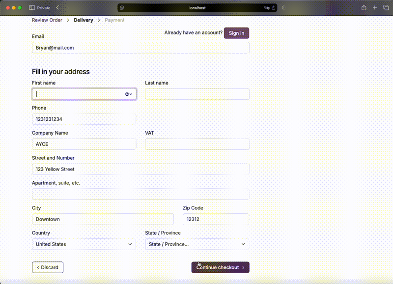
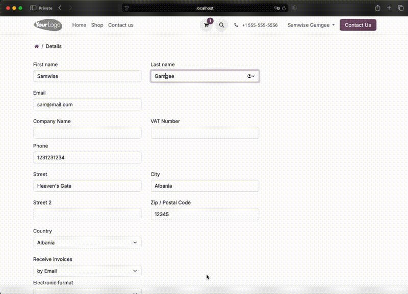

=============================
First & Last Name at Checkout
=============================

This module extends the website checkout and portal to use separate
first name and last name fields, leveraging the ``partner_firstname``
module for name splitting.

Usage
=====

Once installed, the single "Name" field is automatically replaced by
separate "First name" and "Last name" fields on:

- The checkout address form (``/shop/address``)
- The portal account details page (``/my/account``)

Both fields are mandatory. Whitespace-only values are rejected.

No configuration is required.

Credits
=======

Authors
~~~~~~~

* Aaron Ngu <aaron@swimmingchicken.com>
